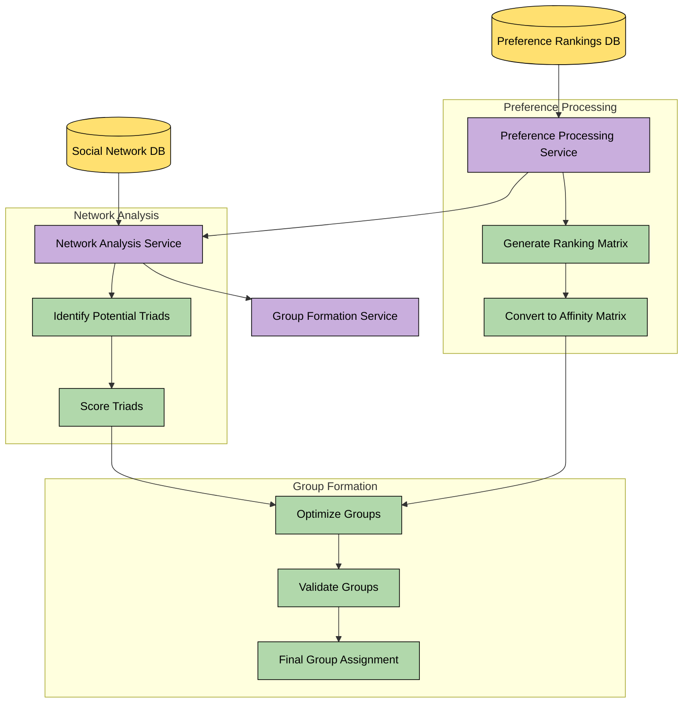
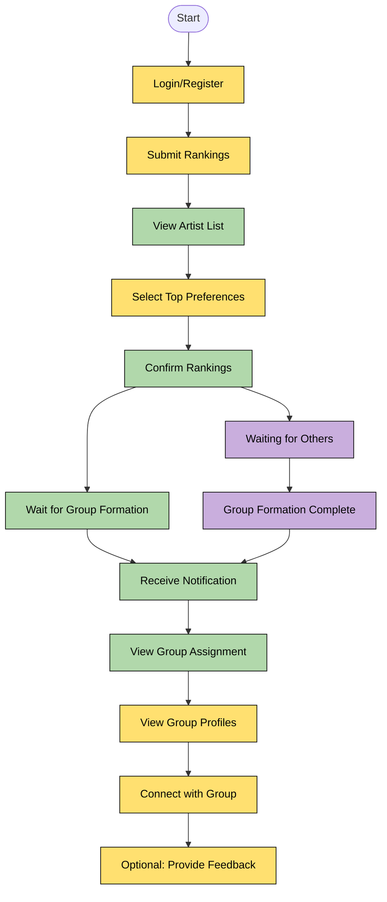

# Creative Contact - Matching Services

## Architectures



## User flow



## Development

`just dev` to run the project.

### Environment

We use `uv` to manage our python environment. Cheatsheet below:

#### Environment management:

```bash
uv venv: Create a new virtual environment.
```

####  Project management:

```bash
uv init # Create a new Python project.
uv add # Add a dependency to the project.
uv remove # Remove a dependency from the project.
uv sync # Sync the project's dependencies with the environment.
uv lock # Create a lockfile for the project's dependencies.
uv run # Run a command in the project environment.
uv tree # View the dependency tree for the project.
uv build # Build the project into distribution archives.
uv publish # Publish the project to a package index.
```

### Deployment

We deploy with fly.io.

```bash